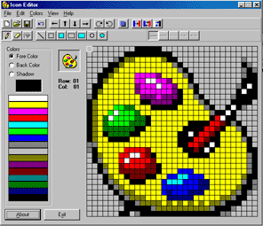



## IconEditor

### Description

This program can help you to create your own ICONS and save theme in standard ICO or BMP format for windows.

Attention: Icons can be only 32x32 (16 Color)
 
### More Info
 

             |
---                |---
**Submitted On**   |2001-07-02 09:25:12
**By**             |[Ali Amirnezhad](https://github.com/Planet-Source-Code/PSCIndex/blob/master/ByAuthor/ali-amirnezhad.md)
**Level**          |Intermediate
**User Rating**    |4.8 (81 globes from 17 users)
**Compatibility**  |VB 6\.0
**Category**       |[Graphics](https://github.com/Planet-Source-Code/PSCIndex/blob/master/ByCategory/graphics__1-46.md)
**World**          |[Visual Basic](https://github.com/Planet-Source-Code/PSCIndex/blob/master/ByWorld/visual-basic.md)
**Archive File**   |[IconEditor22045722001\.zip](https://github.com/Planet-Source-Code/ali-amirnezhad-iconeditor__1-24644/archive/master.zip)

